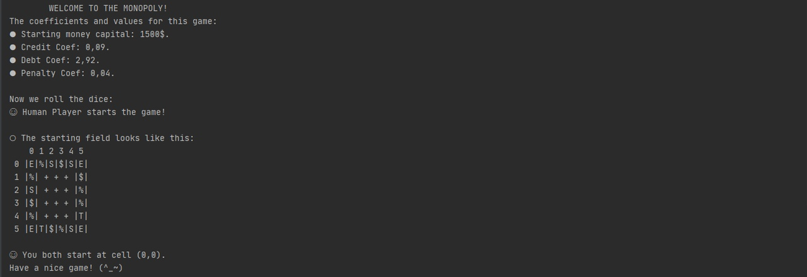
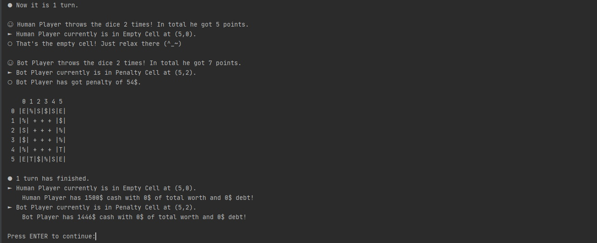

# School Project: Console Game Monopoly.
## Kocharyan Tigran BSE199.
---

## Description:

* User inputs the height and width of field and the starting money amount as console args. Then he gets the greeting message in Console and game starts.

* In the current version there are only 2 players: you and bot player. Bot doesn't cooperate with banks and randomly purchases the shop.

* There are Bank cells, Shop cells, Penalty Cells, Empty Cells and Taxi Cells. All the description of actions will be also written after entering the cell. 

    + Bank Cells can lend some money to the player or take the money back next time he enters.

    + Shop Cells can be purchased, upgraded and once the opponent enters the shop - he pays the compensation.

    + Penalty Cells take the speicific money penalty from player on entering.

    + Empty Cells do nothing :)

    + Taxi Cells move player forward for a random distance.
    
* Once a player becomes a bankrupt (cannot pay the debt or compensation), his opponent becomes a winner and the appropriate message is output.
---

## Example:
#### Screenshot 1. Input height, width and starting money amount.

#### Screenshot 2. Greeting Message.

#### Screenshot 3. End of turn and ENTER to continue.

---
## [Контакты.](https://vk.com/k_tigran)
